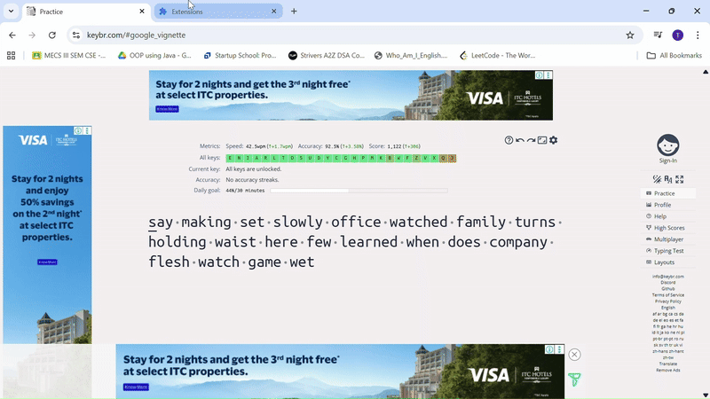

# DOM Ad Cleaner

DOM Ad Cleaner is a lightweight Chrome extension that removes intrusive
**DOM-based advertisements** such as banners, popups, overlays, and sticky ads
using safe runtime DOM manipulation.

It focuses on improving page readability and usability **without blocking
network requests or interfering with core site functionality**.

---

## ✨ Features

- Removes popup ads, banners, and sticky containers
- Collapses ad placeholders to preserve layout
- Handles dynamically injected ads using `MutationObserver`
- Restores scrolling and pointer interaction
- Safe for complex sites (YouTube layout–friendly)

---

## 🧠 How It Works

DOM Ad Cleaner operates entirely at the **DOM level**:

- Detects ad iframes using common ad service patterns
- Collapses known ad container elements (Google Ads, banners, adhesion units)
- Removes fullscreen overlays and scroll blockers
- Continuously observes the page to handle ads injected after load

> No network interception. No request blocking. No filter lists.

---

## ⚠️ Limitations

- This extension **does not block server-side or video ads**
- YouTube video ads (pre-roll / mid-roll) are **not removed**
- For network-level ad blocking, use tools like **uBlock Origin** or **Brave Browser**

DOM Ad Cleaner is designed to complement—not replace—full ad blockers.

---

## 📌 Why DOM-Based Cleaning?

- Safer than request blocking
- Less prone to site breakage
- Works even when ads bypass traditional blockers
- Lightweight and easy to maintain

---

## 🚀 Installation

1. Clone this repository
2. Open `chrome://extensions`
3. Enable **Developer Mode**
4. Click **Load unpacked**
5. Select the project folder

---

## 👨‍💻 Author

**Balne Thrinath**

---

## 📄 License

MIT

---

## ⭐ Support

If FocusTube helps you stay focused, consider giving the project a ⭐ on GitHub.  
It helps others discover the project and supports continued improvement.
